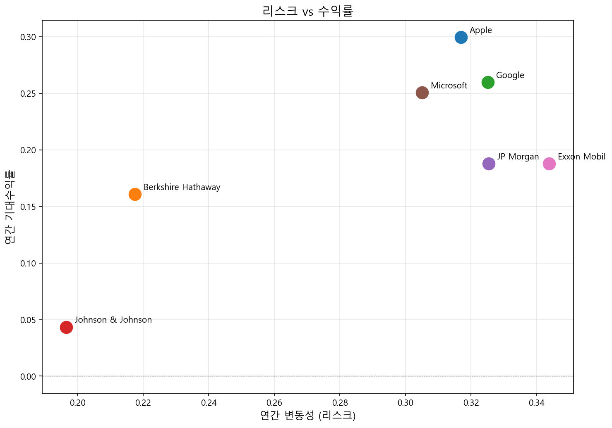
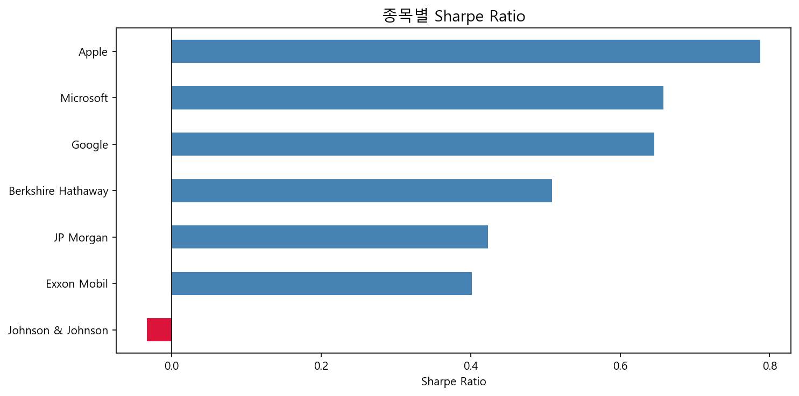
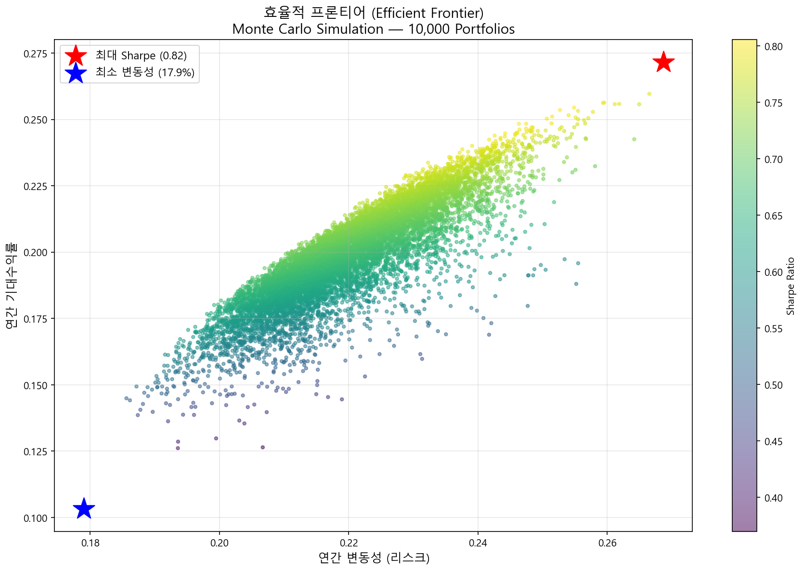
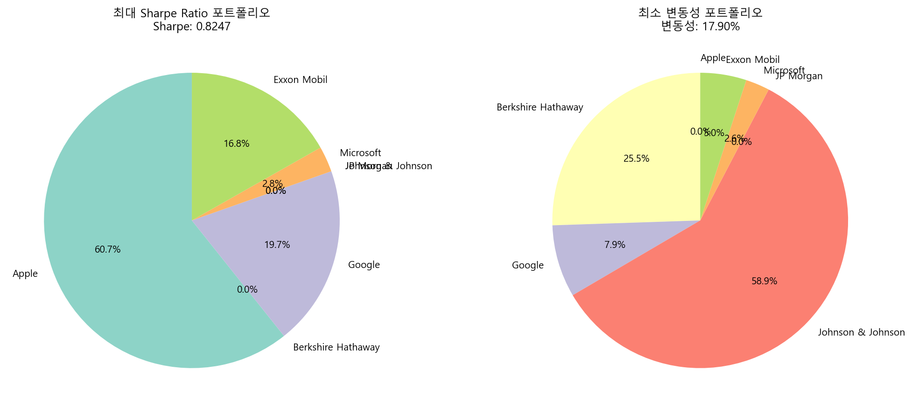

# Portfolio Optimization | 글로벌 주식 포트폴리오 최적화

Optimizing a global equity portfolio using Modern Portfolio Theory, Monte Carlo Simulation, and Efficient Frontier analysis.  
현대 포트폴리오 이론(MPT)과 몬테카를로 시뮬레이션을 활용하여 글로벌 주식 포트폴리오를 최적화하는 프로젝트입니다.

---

## Overview

This project implements Harry Markowitz's Modern Portfolio Theory to identify the optimal asset allocation among 7 global equities. By simulating 10,000 random portfolios, we visualize the Efficient Frontier and derive two key optimal portfolios.

7개 글로벌 주식을 대상으로 10,000개의 포트폴리오를 시뮬레이션하여 효율적 프론티어를 시각화하고, 최대 Sharpe Ratio 및 최소 변동성 포트폴리오를 도출했습니다.

---

## Data

- Source: Yahoo Finance (yfinance)
- Period: 2020-01-01 ~ 2024-12-31
- Assets: Apple, Microsoft, Google, JP Morgan, Berkshire Hathaway, Johnson & Johnson, Exxon Mobil

---

## Process

### Step 1: Data Collection & Preprocessing
- Retrieved 5-year historical price data via Yahoo Finance API
- Normalized price series for comparative visualization
- Calculated daily returns and handled missing values

### Step 2: Risk & Return Analysis
- Computed annualized returns and volatility per asset
- Plotted Risk vs. Return scatter to identify asset characteristics
- Calculated Sharpe Ratio per asset (risk-free rate: 5%)




### Step 3: Portfolio Optimization
- Ran Monte Carlo Simulation with 10,000 random portfolios
- Applied SciPy optimization (SLSQP) to find:
  - Maximum Sharpe Ratio Portfolio
  - Minimum Volatility Portfolio
- Visualized the Efficient Frontier




---

## Results

| Portfolio | Return | Volatility | Sharpe Ratio |
|-----------|--------|------------|--------------|
| Max Sharpe | ~28% | ~22% | 0.82 |
| Min Volatility | ~17% | ~15% | 0.80 |

**Key Findings:**
- Apple dominates the Max Sharpe portfolio (~60%) due to superior risk-adjusted returns
- Johnson & Johnson anchors the Min Volatility portfolio (~59%) as a defensive asset
- Tech stocks (AAPL, MSFT, GOOGL) show high correlation, reducing diversification benefit

---

## Tech Stack


---

## How to Run
```bash
git clone https://github.com/bizseohyunkim/Portfolio-Optimization.git
cd Portfolio-Optimization
pip install yfinance numpy pandas matplotlib scipy seaborn
```

Run notebooks in order:
1. `1_data_collection.ipynb`
2. `2_analysis.ipynb`
3. `3_optimization.ipynb`

---

## References

- Markowitz, H. (1952). Portfolio Selection. *Journal of Finance*
- Modern Portfolio Theory — Efficient Frontier
